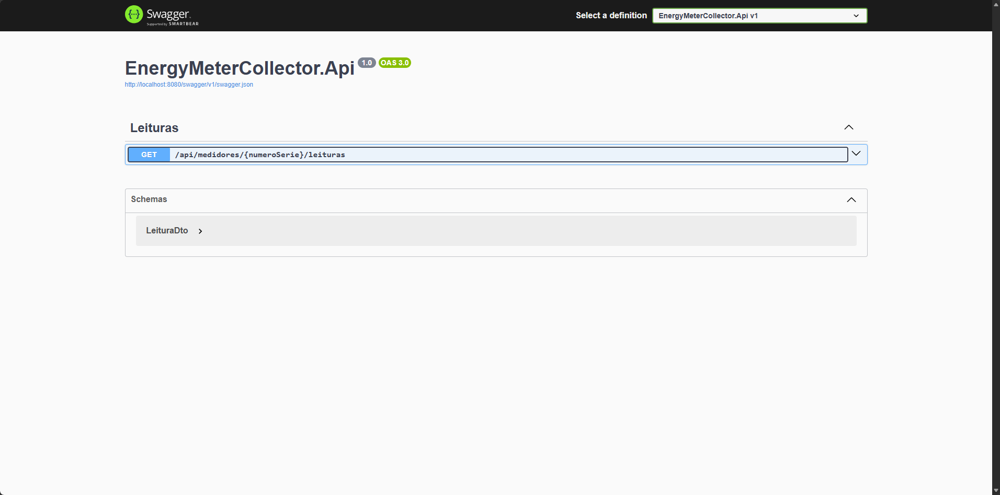

# EnergyMeterCollector

Coletor de telemetria de medidores de energia: lê um medidor via **Modbus TCP**, persiste as leituras, publica em **MQTT** e expõe tudo numa **API REST**. Construído em **.NET 8** com **Clean Architecture** e testes (unitários + integração).



```
┌─────────────┐   Modbus TCP   ┌──────────────────────────────┐
│ MeterSimulator│ ─────────────▶ │  API + Coletor (BackgroundSvc)│
│ (medidor fake)│   :502         │   • lê a cada 5s              │
└─────────────┘                 │   • grava (EF Core/SQLite)    │
                                │   • publica MQTT ────────────┼──▶ Mosquitto :1883
                                │   • expõe GET /leituras       │
                                └──────────────────────────────┘
                                              :8080
```

## Por que esse projeto

Simula um cenário real de **coleta de dados de hardware/IoT**: um equipamento de campo (medidor) falando um protocolo industrial aberto (Modbus), um coletor resiliente puxando os dados em ciclo, mensageria para distribuir as leituras e uma API para consumo. A arquitetura deixa "plugar" outros drivers de medidor no futuro sem tocar no domínio.

## Arquitetura (Clean Architecture)

```
Api ─────────────┐
                 ├─▶ Application ──▶ Domain
Infrastructure ──┘        ▲
(Modbus, MQTT, EF Core) ──┘
MeterSimulator   (console: servidor Modbus TCP que finge ser um medidor)
Tests            (xUnit + FluentAssertions + Moq)
```

- **Domain** — entidades e invariantes (`Medidor`, `Leitura`); zero dependência externa.
- **Application** — casos de uso (`RegistrarLeituraHandler`) e *ports* (`IModbusLeitor`, `ILeituraRepository`, `ILeituraPublisher`).
- **Infrastructure** — *adapters*: driver Modbus (FluentModbus), publisher MQTT (MQTTnet), persistência (EF Core + SQLite).
- **Api** — controllers REST + o **Coletor** (`BackgroundService`) que orquestra o fluxo.

A dependência aponta sempre para dentro (Application/Domain não conhecem Infrastructure) — Inversão de Dependência do SOLID.

## Tecnologias

| Camada | Stack |
|---|---|
| Linguagem/Runtime | C# / .NET 8 |
| Protocolo de campo | Modbus TCP (FluentModbus) |
| Mensageria | MQTT (MQTTnet + Eclipse Mosquitto) |
| Persistência | EF Core + SQLite |
| API | ASP.NET Core (REST + Swagger) |
| Testes | xUnit, FluentAssertions, Moq |
| Empacotamento | Docker + Docker Compose |

## Como rodar

### Com Docker (recomendado — sobe tudo sozinho)

```bash
docker compose up --build
```

Sobe **simulador → coletor → banco + MQTT → API**. Após ~10s, consulte as leituras (que crescem a cada 5s):

```bash
curl http://localhost:8080/api/medidores/MED-001/leituras
```

Swagger: <http://localhost:8080/swagger>. Para parar: `Ctrl+C` e `docker compose down` (`-v` também apaga o banco).

### Local (sem Docker)

```bash
dotnet run --project MeterSimulator          # terminal 1: medidor fake na :502
dotnet run --project EnergyMeterCollector.Api # terminal 2: API + coletor
```

> Sem Docker, ajuste `Modbus:Host`/`Mqtt:Host` no `appsettings.json` para `127.0.0.1`. O teste de integração MQTT precisa de um broker em `localhost:1883`.

## API

| Método | Rota | Descrição |
|---|---|---|
| `GET` | `/api/medidores/{numeroSerie}/leituras?inicio=&fim=` | Lista as leituras do medidor; filtros de período opcionais |

Rota hierárquica (medidor é recurso-pai, leitura é sub-recurso) que espelha o tópico MQTT `medidores/{serie}/leituras`.

## Testes

```bash
dotnet test
```

Unitários (invariantes do domínio, handler com Moq) + integração (repositório com SQLite `:memory:`, Modbus contra o simulador, API com `WebApplicationFactory`). O teste de MQTT fica `Skip` por padrão (requer broker) — habilite com o Compose de pé.

## Decisões de projeto

- **Modbus** como protocolo: aberto e representativo de medição industrial; ABNT/DLMS/ANSI são complexos e fechados. A arquitetura permite plugar outros drivers depois.
- **Coletor como `BackgroundService` dentro da API** (não num Worker separado): o banco é **SQLite (um escritor só)**, então um único processo dono do arquivo evita lock entre containers. Trocando para SQL Server, separar num Worker fica trivial.
- **Coletor resiliente**: `try/catch` por ciclo — se simulador/broker ainda não subiram, loga e tenta no próximo, sem derrubar o serviço.
- **DTO na API** em vez de expor a entidade `Leitura` (evita vazar detalhe de domínio).
- **Config por ambiente**: `appsettings.json` para dev local; o Compose sobrescreve hosts via variáveis (`Modbus__Host`, `Mqtt__Host`).
